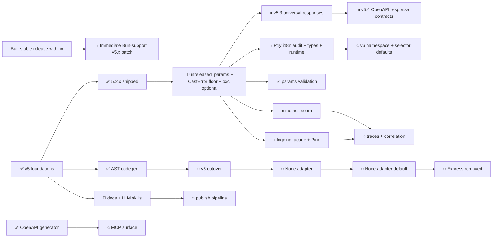

# Framework Refactor

Status = directory. Move a file to change its status.

`done/` shipped · `active/` in flight · `queued/` next · `later/` v6 + far horizon

## Tracks & dependencies

```
v5 (done/) ──→ ┬──→ codegen track ──[AST front-end SHIPPED]──→ v6 cutover (later/)
               │    P1n AST replaced ghost+regex; v6 = drop skipWrap / boot-fallback
               │
               ├──→ docs / skill track ─────────────→ publish
               │    docs-sweep ✅ (re-swept 06-22) · doc additions ✅ · generator + llms.txt ← TODO
               │
               └──→ polish (independent) ───────────→ any order
                    [rate-limiter-lazy ✅] [cache-drivers ✅] [test-helpers ✅]

v5.3 (queued/) ─────→ universal HttpResponse + Express writer
                      └──→ OpenAPI response contracts ──→ v6 removes ordinary `res`

Bun stable with fix (external) ──→ immediate Bun-support v5.x patch
                                  never waits for v5.3, v6, or native adapters

v5.2.0/5.2.1/5.2.2 ─→ shipped
next release ───────→ params: schema + CastError floor + OpenAPI params
                      + oxc-parser optional peer + node:test + benchmark repair
                      └──→ version undecided (behavior change ⇒ minor?) · UNRELEASED

Blocking: docs-sweep re-sweep ✅ done → llm-skills generator now unblocked
          v5.3 (P1q) waits on publishing the current unreleased work
          v5.4 OpenAPI response contracts waits on P1q landing + real usage
          v6 cutover blocked by all v5.1 active + queued work
          Bun runtime support blocked only by Bun shipping the fix in stable
          node-adapter blocked by v6 — and is what unlocks HTTP/2 (stock node:http2,
            NOT a native-engine payoff; Express as listener is the only blocker)
          drop-express blocked by node-adapter
```

## Visual roadmap



`✅ done` · `🔄 active` · `⏸ queued` · `◌ later`

For an interactive, collapsible view of any plan, render its Markdown with
[Markmap](https://markmap.js.org/docs/packages--markmap-cli):

```sh
npx markmap-cli .plans/refactor/queued/i18n-contracts-and-tooling.md \
  -o /tmp/framework-i18n-plan.html
```

Add `--watch` while editing. The HTML is intentionally written outside the
repository; Markdown remains the reviewed source of truth.

## Index

### active/

| File | Ref | Summary |
|---|---|---|
| [i18n-default-values](active/i18n-default-values.md) | P1y-bridge | **Optionally translatable framework messages, English-in-code.** PR 1: middleware `translate()` helper + `middleware.*` keys with `defaultValue` (byte-identical when untranslated) + disabled-i18n fallback honours defaults. PR 2: sweep controllers/validation/email bare keys (raw-key leak → English, behavior change) + i18next → optional peer. Bridge to P1y Phase 4. |
| [llm-skills](active/llm-skills.md) | P1h | Doc additions ✅ (15-recipes, 16-anti-patterns). Still TODO: skill generator + `llms.txt` + `npx skills add` publish pipeline (no `skills/` dir or `llms.txt` in docs repo yet). docs-sweep ✅ now unblocks this. Note: docs `npm run build` already regenerates `static/llm-context.md` via `scripts/generate-llm-context.js`. ~1.5 d. |

### queued/

| File | Ref | Summary |
|---|---|---|
| [bun-runtime-support](queued/bun-runtime-support.md) | Runtime | **Stable-fix-gated Bun certification.** Activate immediately when Bun ships `oven-sh/bun#32502` in any stable version; run the existing Express adapter through Bun's Node compatibility layer, require real Mongoose CRUD and packed-consumer CI, then cut an immediate v5.x patch. Never waits for v5.3, v6, or P3/P5; native `BunAdapter` remains separate. |
| [universal-http-responses](queued/universal-http-responses.md) | P1q | **v5.3 typed response bridge.** Returned JSON/text/empty/redirect/stream/file/native-Web response descriptors rendered by Express; thrown errors normalize to the same writer. Legacy `res` coexists in v5.3; ordinary controller `res` is removed in v6. Parent design for OpenAPI responses and the adapter-independent HTTP path. |
| [openapi-responses](queued/openapi-responses.md) | P2a-resp | **Response-contract/OpenAPI phase of P1q.** Merge typed handler outcomes with structural validation/middleware/error responses; optional Standard-Schema `responses:` map is authoritative for body schemas. Never fabricate schemas from syntax-only AST data. |
| [metrics-seam](queued/metrics-seam.md) | P1s | **Observability Phase 1 — metrics.** No-op-default metrics API plus automatic HTTP RED/runtime metrics, an optional Prometheus exporter, and `/metrics`; strict cardinality rules throughout. |
| [logging-facade-and-pino](queued/logging-facade-and-pino.md) | P1z | **Vendor-neutral logging + Pino.** Lock a framework-owned structured logger/Error contract in v5.x, then cut `IApp.logger`, config, Sentry and tests from Winston to a Pino-backed sink runtime in v6; LogTape remains a conformance-gated future option. |
| [http-engine-spike](queued/http-engine-spike.md) | Spike | **Native HTTP engine go/no-go.** Benchmark ladder in `benchmark/engines/`: Express baseline → `NodeAdapter` prototype (= P3 preview) → uWS → minimal Rust engine (napi vs UDS child-process, gated on uWS numbers). Pre-agreed thresholds; informs keep/skip P2c, P3 timing, and whether a native adapter joins the P3/P5 adapter family. Nothing ships. |
| [email-templates-v2](queued/email-templates-v2.md) | Cross-repo | **Shipped email templates → JS/TS modules.** Module 2.1 ships built-in `js`/`ts` module engines (overridable map entries); framework converts its 6 pug defaults to typed template modules (fixes hardcoded-Russian verification + carries i18n defaultValue), trims the `postbuild` copy. Module first, then framework; after 5.4. |
| [i18n-contracts-and-tooling](queued/i18n-contracts-and-tooling.md) | P1y | **Typed, auditable i18n for framework + projects.** Missing/unused/coverage checks, generated autocomplete, large-catalog selector mode, isolated runtime instance/backend seam; additive v5 foundation and v6 framework-namespace cutover. |

### later/

| File | Ref | Summary |
|---|---|---|
| [static-middleware-cutover](later/static-middleware-cutover.md) | P1f | v6: drop instance schema getters, remove `skipWrap` + `process.exit(0)` (= P1j Phase 5). v5.x bridge ✅ (P1j Phase 1). Note: the AST boot/ghost fallback was already deleted in v5.0.0 (P1n), so Phase 7 is partly done. |
| [async-middleware](later/async-middleware.md) | P1m | v6: **async/await middleware contract.** Drop Express's `next` callback — return → continue, `throw` → error, send response → stop. Collapses the adapter's Promise-bridge. Design call open (linear drop-`next` vs awaitable-`next` onion; A recommended). Best landed with static-middleware-cutover. |
| [observability](later/observability.md) | P2b | **Observability phases 2+.** OTel traces, log correlation, Sentry, health/readiness, diagnostics channels and profiling after the P1s metrics foundation. |
| [performance](later/performance.md) | P2c | find-my-way, fast-json-stringify. |
| [mcp-surface](later/mcp-surface.md) | P2d | Full MCP server (read + write). Now unblocked — the `toJsonSchema` seam + registry walk shipped with [openapi-generator](done/openapi-generator.md). |
| [jobs-module](later/jobs-module.md) | P2e | **Abstract durable jobs module + drivers.** At-least-once delivery state, bounded retry/backoff, dead letters, idempotency guidance, and P1s metrics. Redis/custom drivers stay optional; no silent no-op or memory fallback for durable queues. |
| [node-adapter](later/node-adapter.md) | P3 | Drop Express router. Blocked by v6. |
| [default-node-adapter](later/default-node-adapter.md) | P4 | NodeAdapter as default. |
| [drop-express](later/drop-express.md) | P5 | Edge-compatible, Express gone. Blocked by P3+P4. |
| [mongo-er-diagram](later/mongo-er-diagram.md) | Side | Issue #11. |
| [select-projection-typing](later/select-projection-typing.md) | Side | Type `.select(...)` results to the projected fields (typing track). Object-form first; fixture-gated. |
| [vitest-to-node-test](later/vitest-to-node-test.md) | Side | Replace vitest with `node:test`. Best slot: after v5.1. |

### done/

| File | Ref | Summary |
|---|---|---|
| [params-validation](done/params-validation.md) | P1b+ | **Implemented 2026-08-07, unreleased.** Route `params:` schema (validate + coerce path params → `req.appInfo.params`, malformed → 400). Grew beyond plan: also a standalone-`CastError` 400 floor and OpenAPI path-parameter typing. |
| [codegen-literal-prelude](done/codegen-literal-prelude.md) | P1w | **Shipped in 5.2.1.** Initialized `const` config reads may precede a literal route return. |
| [v5.2.1-adoption-fixes](done/v5.2.1-adoption-fixes.md) | P1x | **Shipped in 5.2.1.** Grouped same-name controller override identity; `defineSchema` explicit JSON Schema; Pagination emits `page`/`limit`. |
| [openapi-schema-resilience](done/openapi-schema-resilience.md) | P2a-fix | **Shipped in 5.2.0.** Zod input-shape/date export plus per-schema failure containment; one unrepresentable route no longer aborts the document. |
| [controller-route-groups](done/controller-route-groups.md) | P1u | **Shipped in 5.2.0.** Parenthesized controller folders organize source without contributing URL segments; runtime and AST codegen share path derivation. |
| [node-test-readiness](done/node-test-readiness.md) | P1v | **Shipped in 5.2.0.** Public idempotent server-readiness helper prevents sibling root hooks from racing node:test bootstrap; regression and migration warnings included. |
| [public-cluster-runner](done/public-cluster-runner.md) | P1r | **Shipped in 5.1.4.** Narrow public `runCluster` with fixed crash-loop safety, structured lifecycle events, signal forwarding, and shutdown timeout; framework/example entries and docs migrated; packed smoke green. |
| [named-rate-limit-policies](done/named-rate-limit-policies.md) | P1t | **Included in 5.1.4.** Typed merged-config recipe using `policy.someName` directly; canonical docs and example updated; no framework runtime change. |
| [baseline](done/baseline.md) | P−1 | Perf pin 2026-05-03: plaintext 16591 req/s, realistic 15549 req/s. |
| [type-contracts](done/type-contracts.md) | P0 | `BaseRequestContext`, `ProvidesOf`, `UnionAppInfoProvides`. |
| [runtime-validators](done/runtime-validators.md) | P1a | Standard Schema dispatch, `ValidatorDriver`, `ValidationError`, auto-i18n. 132/132 tests. |
| [codegen-mvp](done/codegen-mvp.md) | P1a | Per-handler `<Method>Request` aliases via runtime introspection. 137/137 tests. Replaced by P1b codegen rewrite. |
| [tree-router](done/tree-router.md) | P1b | Tree-based `RouteRegistry`, `ExpressAdapter`, `ControllerManager`. +28% plaintext / +10% realistic. 211/211 tests. |
| [controller-migration](done/controller-migration.md) | P1d | Home + SomeController translated through the registry. |
| [boot-route-tree-log](done/boot-route-tree-log.md) | P1e | Boot-time project-wide route tree log from `RouteRegistry` (`formatTree.ts`, verbose level). |
| [yup-optional](done/yup-optional.md) | P1k | yup un-bundled: `defineSchema` + `File` export (optional peer); `YupFile` deprecated; content-type-keyed request schemas. beta.51. |
| [mongoose-validation-safety-net](done/mongoose-validation-safety-net.md) | P1o | **Escaped Mongoose `ValidationError` → 400** when ALL failing model paths match `req.appInfo.request`/`query` keys (first segment, minus `contentType`); any renamed/internal path → 500 stays (never leak model paths); warn/error log split. Shipped 2026-07-05 (905b217), v5.1 behavior change. Superseded plumbing-wise by P1p (net now a registry built-in; semantics unchanged). |
| [error-handler-registry](done/error-handler-registry.md) | P1p | **Typed HTTP errors + extensible error→response registry.** `HttpError` + 5 subclasses (`services/http/httpErrors.ts`); `httpServer.registerErrorHandler(ErrorClass, fn, {logLevel?})` → unregister fn; consumer tier before built-ins (HttpError mapper verbose + P1o net warn), first non-null wins, handler-throw aborts → 500. Catch block = headersSent → registry walk → 500. Implemented 2026-07-05 ([impl plan](done/error-handler-registry-implementation.md)); docs chapter 06-Controllers/04-error-handling written (docs repo, uncommitted). Additive, v5.1. |
| [config-schema-codegen](done/config-schema-codegen.md) | P1l | `getConfig()` emits inline value-**shape** types (no literals, no secrets, no `import()`; arrays stay tuples). beta.54. |
| [codegen-ast](done/codegen-ast.md) | P1n | oxc AST codegen front-end — replaced ghost + regex (`importResolution.ts` + `ghostController.ts` **deleted**). Shipped v5.0.0; boot fallback removed → declarative controllers required. |
| [codegen-zero-init](done/codegen-zero-init.md) | P1j | Zero-init `npm run gen` (no controller/middleware/model `new`). Delivered via the AST front-end (P1n); Phases 0–3 ✅, Phase 4 moot. **Phase 5 (drop `skipWrap` + `process.exit(0)`) → v6** under [static-middleware-cutover](later/static-middleware-cutover.md). |
| [openapi-generator](done/openapi-generator.md) | P2a | OpenAPI 3.1 generator (`npm run openapi`) + vendor-neutral `toJsonSchema` driver seam (zod native, yup `describe()`, graceful placeholder). Runtime walk of `RouteRegistry.flatten()`. Unblocks MCP (P2d). 2026-06-20. |
| [test-helpers](done/test-helpers.md) | P1i | Runner-agnostic test setup (`setupFramework`); `setupVitest`/`globalSetupVitest` thin wrappers + new `setupNodeTest` → consumers can use `node:test`. vitest optional peer. Folded-in `createTestApp` utils NOT built. 2026-06-21. |
| [cache-drivers](done/cache-drivers.md) | P1c | **Make redis optional (cache half).** `CacheDriver` interface + memory-default driver + lazy redis driver; `config/cache.ts`; zero-TTL skip (#10, #13). Default cache backend is now in-memory. 2026-06-22. |
| [rate-limiter-lazy](done/rate-limiter-lazy.md) | P1b+ | **Make redis optional (rate-limiter half).** RateLimiter redis driver lazy-`import()`s `@redis/client` (deferred `whenReady`, non-blocking sync client); memory/mongo never touch it. `@redis/client` flipped to an optional peer with cache-drivers. 2026-06-22. |
| [docs-sweep](done/docs-sweep.md) | P1g | Audit the documentation repository against v5 behavior. Pass 1 ✅ (2026-06-06) + Pass 2 re-sweep ✅ (2026-06-22, 18 chapters, 5 audit agents). Build green (`onBrokenLinks: throw`). Unblocks llm-skills. |

## v5.1 extras (no phase doc — tracked as bullets)

- `bodyParsing: 'parsed' | 'raw' | 'none'` modes + parser registry (`app.parsers`)
- `File` type export — ✅ shipped (beta.51)
- **Route-level multipart single-element extraction** — let a route declare which multipart fields are scalar; the router unwraps their single-element arrays **before** validation, so the schema stays the clean logical shape (`avatar: z.instanceof(File)`) and codegen reads that output type directly. Chosen over a schema-side `multipartScalar` helper (that wrapper was prototyped and dropped — it pushed a parser concern into the schema/types). Interim: validator-native `.array().length(1).transform(...)`. Revisits the parser-side `getFieldShape` idea from `decisions.md` → "Multipart parser is always-array" as an opt-in route convenience. Not scheduled.
- ✅ **Project boot hook (`bootHttp`)** — shipped 2026-06-22. **Explicit** `Server` constructor option `bootHttp(app)` (type `BootHttpHook`), called in `startServer` after controllers register, before the adapter mounts (type + call inlined in `server.ts` — no separate module). Explicit, NOT file-discovered — every framework folder is owned (config/ merges its files, controllers/ auto-loads its files), so there's no conflict-free folder to scan. HTTP-specific (needs `app.httpServer`). For ad-hoc routes (`registerRoute`) + Express middleware + boot setup. **`useGlobal`/global-middleware positioning still deferred** — lands in this same hook later (see [tree-router](done/tree-router.md) note).
- ✅ **`routes` CLI command** — shipped 2026-06-22. `node src/cli.ts routes` / `npm run routes` prints the route tree via `formatRouteTree` over a `skipWrap` registry build (the `openapi` command's pattern). `formatTree.ts` got its first unit test (0→96%).

## v5.1.4 — released 2026-07-19

- ✅ [Public cluster runner](done/public-cluster-runner.md) — additive Node-only export with fixed
  safety policy, lifecycle events, signal forwarding, and bounded shutdown.
- ✅ [Typed rate-limit policy recipe](done/named-rate-limit-policies.md) — documentation/example
  only; no framework runtime change.
- ✅ Documentation corrections: default controller paths come from folder prefix + lowercased class
  name (not filename), and ordinary API tests assert raw application i18n keys unless application
  locales are explicitly loaded.

## v5.2.0 — released 2026-07-20

- ✅ [OpenAPI schema resilience](done/openapi-schema-resilience.md) — request-input Zod export,
  coerced date-time convention, and per-schema containment.
- ✅ [Route-transparent controller groups](done/controller-route-groups.md) — parenthesized folders
  organize source without changing URLs or generated-type placement.
- ✅ [Deterministic node:test readiness](done/node-test-readiness.md) — application root hooks and
  the framework preload await one server-start promise; testing migration traps are documented.

## v5.2.1 — released 2026-07-20

- ✅ [Literal route-getter setup](done/codegen-literal-prelude.md) — initialized `const` config reads
  may precede a literal return, keeping route-local typed policy tuples codegen-safe.
- ✅ [5.2.1 adoption fixes](done/v5.2.1-adoption-fixes.md) — Pagination contributes its optional
  `page`/`limit` parameters to OpenAPI, and a grouped same-name controller remains an override.

## 5.2.2 — released 2026-08-01

- Model-typing regression coverage for complex schema/document patterns.
- `defineSchema(validate, { jsonSchema })` — dependency-free explicit OpenAPI shape.

## 5.3.0 — unreleased

Version settled 2026-08-08: it carries a behavior change (`CastError` 500 → 400), a new feature
(`params:`), and a consumer-action item (`oxc-parser`), so a minor is correct.

- ✅ Framework test suite migrated to `node:test`.
- ✅ [Route `params:` schema](done/params-validation.md) — plus the standalone-`CastError` 400 floor
  (**behavior change**: client-caused cast failures are now 400, not 500) and OpenAPI path-parameter
  typing.
- ✅ `oxc-parser` demoted to an **optional peer** — native codegen-only binary out of production
  installs (27 MB → 24 MB). **Consumer action required**: `npm i -D oxc-parser` to run codegen.
- ✅ Benchmark fixture repaired — it had not booted since `#assertBootConfig` landed, so nothing was
  pinned between 2026-05-10 and 2026-08-08. New reference: plaintext 22,144 req/s · realistic
  18,329 req/s (median of 8, Node 26.5.1). **This is the pre-P1q reference point.**
- ✅ Dead `benchmark2` script removed (targeted `https://` + HTTP/2; the framework serves neither, so
  it reported `0.00 req/s` / 10000 errored).

## v5.4 target (was "v5.3") — P1q line

- [Universal typed HTTP responses](queued/universal-http-responses.md) — additive returned-response algebra + Express writer; JSON/text/empty/redirect/stream/file/native Web response; throwable errors preserved; legacy `res` coexists.
- **Design the P1s metrics hook point during P1q**, even if the metrics driver ships later — the
  ResponseWriter is the instrumentation seam, and adding it afterwards means reopening the hot path.
- Resolve `bodyParsing` — `'raw'`/`'none'` are accepted by the type, do nothing, and the JSDoc still
  promises v5.1. Implement (the request-side half of P1q's thesis) or remove them from the type.
- Small independent items: Node 24 in the CI matrix, Redis tests skipping when Redis is absent,
  the `OpenApiGenerator.ts` NUL byte, deploy-docs TLS/HTTP2 note.

## v5.5 target

- [OpenAPI response contracts](queued/openapi-responses.md) — typed handler outcomes plus structural validation/middleware/error responses and optional authoritative Standard-Schema body contracts.
  **Deliberately split from v5.3**: it documents the descriptors P1q invents, and stabilizing a new
  authoring surface *and* a contract derived from it in one release is too much at once.

## Unscheduled

- [Bun runtime support](queued/bun-runtime-support.md) activates as soon as Bun publishes the fix
  in any stable release and immediately cuts a v5.x patch; it does **not** wait for v5.3, v6, the
  Node adapter, the later native `BunAdapter`, or any unrelated roadmap work.
- [Observability Phase 1 — metrics](queued/metrics-seam.md) stays queued until it is planned with the broader observability work. Its automatic HTTP response status/size measurements may build on P1q's response writer.
- [Vendor-neutral logging + Pino](queued/logging-facade-and-pino.md) starts with an additive v5.x
  contract/conformance phase; the public logger, config and dependency replacement land together
  in v6 because `IApp.logger` currently exposes Winston directly.

## v6 breaking defaults (no phase doc — tracked as bullets)

- Ordinary controllers and registry middleware no longer receive `res`; they return `HttpResponse | void`. Native Web response pass-through and explicitly adapter-specific raw routes remain. See [P1q](queued/universal-http-responses.md).
- Strict Content-Type by default
- Case-sensitive + strict trailing-slash by default
- `YupFile.check` single-file semantics

(Async/await middleware contract — formerly a bullet here — now has its own card: [async-middleware](later/async-middleware.md), P1m.)

## Conventions

- **Each phase doc fits on one screen** when collapsed. Goal, files, API, test plan, out-of-scope, done.
- **Add one Mermaid visual overview when relationships matter** — three or more dependent phases, branches, owners, or downstream consumers. Keep prose authoritative; the diagram is navigation, not a second specification.
- **Out-of-scope lists are mandatory.** "What's NOT in this phase" prevents scope-creep panic.
- **Files touched is exhaustive.** If a phase modifies a file not listed, that's a bug in the plan.
- **Done when is verifiable in under 5 minutes.** Not "feature complete"; specific commands or observations.

## Reference

- [Prior art](./reference/prior-art.md) — Hono internals, TanStack Router codegen, Standard Schema, Encore.ts, OTel HTTP semconv
- [Decisions](./reference/decisions.md) — settled architectural choices
- [Open questions](./reference/open-questions.md) — unresolved trade-offs
- [Glossary](./reference/glossary.md) — `RouteNode`, `HandlerEntry`, `MiddlewareEntry`, `RouteRegistry`, etc.

## Archive

- [`_archive/REFACTOR_PLAN_v1.md`](./_archive/REFACTOR_PLAN_v1.md) — the original synthesis doc
