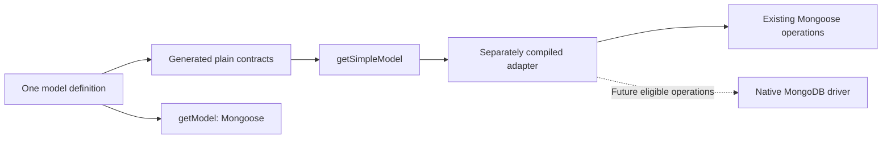

# Simple model API

**Status:** future idea (2026-09-10); not scheduled or implemented.
**Builds on:** [Independent model contract prototype](../done/model-boundary-prototype.md).

## Goal

Offer two ways to access the same model definition: `getModel()` for the full Mongoose API and a proposed `getSimpleModel()` for common persistence operations with small, independent types. Allow gradual adoption while reducing the TypeScript work needed by application code.

## API direction

Illustrative names and signatures, to be settled in an implementation plan:

```ts
const full = app.getModel('Workflow');
const simple = app.getSimpleModel('Workflow');

await simple.findById(id);
await simple.find({ state: 'active' });
await simple.create({ code: 'record-1' });
await simple.updateById(id, { state: 'complete' });
```

- Both access paths use the same model/schema and collection. The existing full API remains available.
- Simple operations return promises of plain records, with explicit null/not-found and update-result contracts. No query chaining or hydrated document methods on this surface.
- Generate concrete read, create, filter and update definitions from one schema source. Bound the supported filters/operators instead of recreating Mongoose's entire type system. Preserve required/default/null distinctions, IDs and dates; unsupported schema features need explicit handling.
- Keep Mongoose types out of the public contract, including lookup registries and dependency-injection signatures. A `Pick` of a Mongoose model does not establish this boundary.
- Compile the adapter/model implementation separately and expose its generated declarations to application checking. Production generation must preserve the existing [zero-init model scan](../done/codegen-zero-init.md); the prototype's runtime schema loading is not a production generator design.

## Hook-aware execution and possible bypass

Start with a simple API backed by the existing Mongoose model. Preserve the semantics of the chosen underlying operation, including its relevant hooks and validation. Specify the operation mapping explicitly: an atomic update must not silently change into a load/modify/save sequence to trigger different hooks.

Future idea: determine capabilities per model **and per operation**, then choose an execution path internally:

| Capability assessment | Proposed execution |
|---|---|
| Relevant hooks or behavior require Mongoose | Use Mongoose behind the same simple contract. |
| Behavior is unknown or unsupported | Keep the Mongoose path, or reject the unsupported simple operation explicitly. |
| No relevant hooks, and other required behavior has proven parity | Consider an opt-in direct MongoDB driver path. |

Hook discovery should account for inherited, plugin, global and operation-specific registrations after model setup is finalized. Do not infer hook absence solely from an empty model hook method or from source syntax. Discovery belongs to runtime model registration; it must not make type generation boot the application. The supported mechanism for collecting this metadata remains an open design question.

**No hooks is not enough to justify bypassing Mongoose.** Casting, validation, defaults, timestamps, setters, schema plugins, sessions and error/result behavior also need an explicit compatibility decision. Falling back to Mongoose must keep the same plain public types so it does not restore the expensive type graph.

Separately explore an explicit hook-bypass policy if needed. Treat it as an intentional behavior change with documented effects, distinct from a path proven to preserve behavior. `getSimpleModel()` alone must not silently disable hooks or validation. Configuration names, eligibility rules and whether deliberate bypass should be supported are not settled.



## Evidence and next investigation

The one-model prototype reduced application instantiations from 566,802 to 270 when comparing emitted full-model declarations with independent contracts. Keeping the adapter/model source in the same compilation gave no reduction; adapter compilation still cost about 725,000 instantiations. These are fixture-scale compiler measurements, not proof of faster database queries or a faster complete rebuild.

Before scheduling implementation: select one representative service, design the separate compilation/lookup boundary, specify supported operations and hook behavior, and measure cold plus changed-input incremental checking. Test hook/no-hook/plugin cases and capability fallback against a real database. Compare runtime performance separately if pursuing a direct-driver path. Coordinate projection support with [the existing projection typing idea](select-projection-typing.md).

## Files and verification

This idea changes only `.plans/refactor/later/simple-model-api.md` and `.plans/refactor/README.md`. Check Markdown links and the diff; the idea is recorded when the index links here and its proposed API, compilation boundary, hook/bypass questions and evidence limits are explicit. A future implementation needs a queued plan naming its actual source/test files, type-contract and runtime conformance fixtures, and all five repository verification gates.

## Out of scope

Implementation now, release scheduling, automatic migration, removal of Mongoose, recreating all native APIs, automatic hook removal, and promises of runtime speedups. No private application names or paths belong in this plan.
