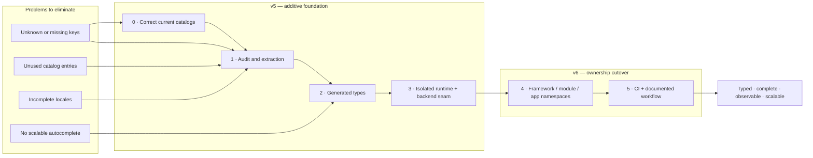

# P1y — i18n contracts, tooling, and resource ownership

**Status**: ⏸ queued (v5 additive foundation; v6 namespace/type default cutover)
**Depends on**: P1a runtime validators ✅, P1n AST codegen ✅
**See also**: [P1y-bridge](../active/i18n-default-values.md) ships `key + defaultValue` at every framework emit site first (v5). Phase 4's namespace codemod must carry its new `middleware.*` keys → `framework:middleware.*`; `defaultValue` remains the runtime safety net after the bundled-catalog cutover.
**Goal**: make translation correctness observable and enforceable in the framework and every consuming project: known keys autocomplete, unknown/missing keys fail, unused keys are reported safely, every locale is structurally complete, and runtime language handling is isolated and extensible.

## Visual overview

## Outcomes / acceptance contract

| Concern | Authoring-time | CI | Runtime |
|---|---|---|---|
| Referenced key does not exist | generated `TFunction`/`TranslationKey` types reject literals and selectors | extractor reports source location and exits non-zero | development-only missing-key telemetry; production falls back |
| Catalog key is unused | editor is not responsible | exhaustive static extraction reports it; deletion is opt-in | intentionally not attempted |
| Locale is incomplete | generated types use the base locale shape | exact key parity, non-empty leaves, placeholder/plural/context parity | configured fallback remains available but cannot make CI pass |
| Key autocomplete at large scale | selector API with `enableSelector: "optimize"` | generated declarations must be current | no additional lookup cost |

The base locale is the structural source of truth. “Coverage” means matching leaf keys, non-empty string values, matching interpolation placeholders, and required plural/context variants; it does not claim linguistic quality. Same-as-base values are warnings, not failures. Dynamic keys require an explicit preserve pattern/manifest—no silent guesses.

## Settled architecture

1. **Keep i18next.** `i18next-fs-backend` remains the default project-resource loader on Node, but loading is an injectable adapter and never owns static correctness.
2. **Separate ownership by namespace.** Framework-owned messages use `framework`; optional modules own unique namespaces; applications own `translation` and feature namespaces. The framework never publishes a global type for an application's namespace.
3. **Compose package types.** Framework/modules augment i18next `ResourceNamespaceMap`; each application generates declarations from its own base-locale files. Do not have multiple packages redeclare `CustomTypeOptions.resources`.
4. **Scale with selectors.** v5 supports generated string-key types plus opt-in selector mode; v6 defaults generated projects to `enableSelector: "optimize"`. The framework must not globally force this scalar type option on consumers.
5. **Static checks are authoritative.** `saveMissing` stays false in production. Runtime observation cannot prove unused keys or unexecuted paths and fallback cannot prove locale completeness.
6. **Report before deletion.** Unused-key removal stays disabled until TS/JS calls, typed validation messages, Pug templates, nested references, plural/context forms, and declared dynamic patterns are all covered and fixture-gated.
7. **Framework resources are bundled.** A project must not copy framework English/Russian files merely to use built-in controllers. Project-supplied framework-locale translations/overrides are merged explicitly after bundled defaults; backend “first hit wins” behavior is not treated as merging.

## Delivery plan

### Phase 0 — pin the current truth (v5, no API change)

- Add the missing `password.wrongToken` value to every shipped locale.
- Record the current static audit baseline: 26 catalog keys, one missing production key, and nine no-production-reference candidates. Review candidates manually; do not delete in this phase.
- Rename `email.greeating` to `email.greeting` in source and catalogs with a temporary deprecated alias if externally addressable.
- Add catalog unit fixtures for a missing key, extra key, blank value, placeholder mismatch, malformed JSON, unknown locale, dynamic preserve pattern, and Pug/validation usage.

### Phase 1 — one audit engine and one report (v5 additive)

- Integrate the official `i18next-cli` analysis/type generator as development tooling; export the framework's config/plugin helper so consuming projects need only declare base locale, locales, paths, and intentional dynamic patterns.
- Add `i18ncheck` (`--json`, `--fix`, `--check-unused`, `--fail-on-warning`) and an equivalent programmatic API. Default is read-only; `--fix` may add/sort skeleton keys but never invent translations or delete unused keys without a second explicit flag.
- Extend extraction for this framework's non-standard sources:
  - ordinary/optional-chained `t` and selector calls;
  - a typed `translationKey`/`translationIssue` helper used by Standard Schema issues;
  - Pug `t(...)` calls through a file plugin;
  - i18next `$t(...)` nesting, plural/context variants, and configured preserve patterns.
- Diagnostics include category, locale/namespace/key, and source file/line where applicable. Fallback resolution is disabled for per-locale coverage checks.
- Add scripts: `i18n:check`, `i18n:status`, `i18n:sync`, `i18n:types`; wire read-only checks into Code quality CI. Keep `i18next-cli` development-only/optional for consumers; runtime imports none of it.

### Phase 2 — generated types and autocomplete (v5 additive, v6 default)

- Generate an application-owned `i18next.d.ts` plus resource declaration from the application's base locale. Integrate its drift check with `generatetypes --check`; generation must be atomic with existing route/app types.
- Export `TranslationKey<Namespace>` and typed issue helpers; built-in validation schemas stop placing unchecked key-shaped strings directly in `message`.
- v5 default: string-key autocomplete/strict checking, selector mode opt-in. Supply a codemod and migration diagnostics for selector calls.
- v6 default: `enableSelector: "optimize"`; retain an explicit legacy string mode for one major-cycle migration window if i18next still supports it.
- Add a synthetic 25k-key consumer fixture with framework + application + module namespaces. Generation and `tsc --noEmit` must complete without OOM or pathological IDE-style type expansion.

### Phase 3 — runtime correctness and backend seam (v5 additive/internal)

- Replace the shared default i18next singleton with `createInstance()` so a host application's own i18next initialization cannot collide with the framework.
- Pass the complete runtime contract to init: `supportedLngs`, `fallbackLng`, `preload`, explicit namespaces/default namespace, and intentional locale-variant policy.
- Stop unconditionally shortening BCP-47 values. Normalize once and let i18next select supported exact/general variants; test `fr-CA`→`fr-CA`, `fr-BE`→`fr`, unsupported→fallback.
- Return/cache `{ language, t: getFixedT(language) }` instead of mutable language clones. Prove concurrent requests in different languages cannot cross-contaminate.
- Define a lazy backend/resource-provider seam: filesystem default, bundled/in-memory resources, and custom backend. Backend failure is observable; no silent empty catalog. `saveMissing` and write paths are development-only.
- Validate locale/namespace values before they reach filesystem paths even though the current backend also applies defense in depth.

### Phase 4 — namespace/resource ownership cutover (v6 breaking)

- Move built-in resources from `translation.json` to the `framework` namespace and update framework calls/templates to bind that namespace.
- Bundle framework base resources and register module resources without requiring application copies. Merge application framework translations/overrides deterministically (`bundled defaults` then `project overrides`).
- Publish only the `framework` entry in `ResourceNamespaceMap`; modules publish their own entries; generated application declarations own application namespaces.
- Provide a codemod for old unqualified built-in keys and a compatibility warning/alias table for the v5→v6 window. Remove aliases after the documented window.

### Phase 5 — enforcement, documentation, and translator workflow

- CI gates: generated-type drift, missing source keys, locale parity/content/placeholder checks, and framework-owned unused keys. Application unused keys start as warnings and become opt-in errors; dynamic manifests are visible in the report.
- Pre-commit only regenerates types when the base locale changes; it must not rewrite translations unexpectedly. CI remains the source of truth.
- Document: namespace ownership, adding a locale/key, selectors, plural/interpolation examples, Pug limitation, dynamic keys, backend selection, project override precedence, translator handoff, and safe key removal/rename.
- Show a real-project workflow: add base string → sync locale skeletons → translate → regenerate types → check → CI. Include local Node/container, read-only serverless bundle, and remote translation-service deployment examples.

## Files touched (planned, exhaustive by phase)

**Runtime/config**: `src/config/i18n.ts`, `src/services/i18n/I18n.ts`, `src/services/i18n/I18n.test.ts` (new), `src/services/http/middleware/I18n.ts`, `src/services/http/middleware/I18n.test.ts`, `src/services/http/types.ts`, `src/services/http/HttpServer.ts`.

**Typed validation/calls**: `src/services/i18n/types.ts` (new), `src/services/validate/ValidateService.ts`, `src/services/validate/ValidateService.test.ts`, `src/services/validate/types.ts`, `src/controllers/Auth.ts`, `src/controllers/Auth.test.ts`.

**Tooling/codegen**: `src/services/i18n/tooling/config.ts` (new), `src/services/i18n/tooling/plugin.ts` (new), `src/services/i18n/tooling/audit.ts` (new), `src/services/i18n/tooling/audit.test.ts` (new), `src/services/i18n/tooling/types.ts` (new), `src/commands/I18nCheck.ts` (new), `src/commands/I18nCheck.test.ts` (new), `src/commands/GenerateTypes.ts`, `src/codegen/index.ts`, `src/codegen/paths.ts`, `package.json`, `package-lock.json`, `.github/workflows/ci.yml`.

**Resources/templates**: `src/locales/en/translation.json`, `src/locales/ru/translation.json`; v6 adds `src/locales/en/framework.json`, `src/locales/ru/framework.json` and removes the framework-owned content from the old files; `src/services/messaging/email/templates/recovery/{subject,text,html}.pug`.

**Fixtures/docs**: `src/services/i18n/__fixtures__/**` (new), `scripts/packaging-smoke-test.sh`, framework i18n documentation chapter in the documentation repository, and its generated skill/LLM context through P1h's pipeline.

## Test matrix

- Exact missing/unused locations across TS direct calls, selectors, aliases, validation helpers, Pug, nesting, plural/context, and dynamic-preserve fixtures.
- `en`/`ru` parity plus failing `fr` fixtures for absent, blank, placeholder mismatch, extra key, and fallback-masked key.
- Type tests: valid autocomplete surface, invalid key rejection, namespace composition, interpolation params, generated-file drift, 25k-key optimized selector fixture.
- Runtime: one initialization, supported/unsupported/variant languages, framework fallback, project override precedence, filesystem/custom/in-memory backend, load failure, disabled mode, and concurrent fixed translators.
- Packaged consumer smoke: framework namespace works without copied resources; application namespace and optional module namespace both type-check and translate.

## Out of scope

No translation-management SaaS requirement, automatic/AI translation, linguistic review scoring, browser UI framework integration, automatic deletion on first rollout, runtime discovery as a substitute for static analysis, or forced migration of existing applications to selectors before v6.

## Done when

In a packed consumer fixture: an unknown key fails TypeScript; a source key absent from English fails `i18n:check`; an English key absent/blank/mismatched in French fails despite runtime fallback; an unused literal is reported with its catalog location; TS validation and Pug keys are both counted; framework/app/module namespaces compose; 25k keys type-check in optimized selector mode; concurrent English/Russian requests remain isolated; and `npm run check`, `npm run check:types`, `npm test`, and `npm run smoke` pass.
