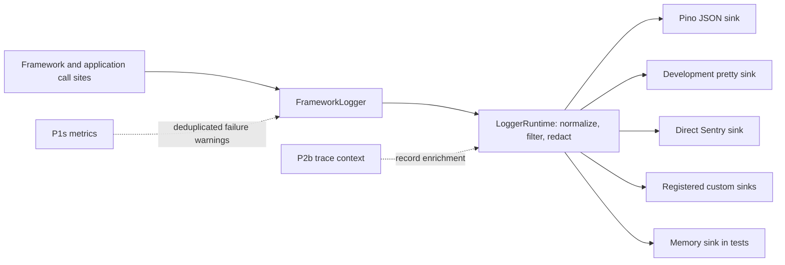

# P1z — Vendor-neutral logging contract and Pino backend

**Status**: 📝 direction settled 2026-08-01 · implementation not started
**Target**: v5.x call-site preparation; v6 public/runtime cutover
**Depends on**: app startup/shutdown and merged config
**Feeds**: [P1s metrics](./metrics-seam.md),
[P2b observability](../later/observability.md), jobs and every framework module
**Origin**: Winston is exposed as public framework API, Error handling depends on call shape,
custom transports receive lossy `info` objects, and framework tests mutate Winston transports.
The current abstraction therefore makes a logger implementation detail part of the application
contract while still failing the most important structured-log case.

## Decision

The framework owns the logging API and normalized record. **Pino is the first production JSON
sink, not the public interface.** Development output and Sentry are separate sinks over the same
record; tests use a memory sink. Consumers can supply framework `LogSink` factories without
depending on Pino or Winston types.

LogTape remains the preferred challenger to re-evaluate after the cutover, but is not the initial
default. Its API and small dependency footprint are attractive; the local evaluation found a
circular custom property on an `Error` can overflow LogTape's JSON Lines formatter, and its global
configuration ownership is awkward for an embeddable framework. Those are correctness and
ownership concerns, not a rejection of LogTape's direction.



This replaces, rather than wraps permanently, the Winston-specific surface:

- `IApp.logger: winston.Logger` becomes `IApp.logger: FrameworkLogger` in v6.
- Winston `.add()`, `.remove()`, `.transports`, formats and transport constructors are not copied.
- Config chooses named framework sinks; it does not dynamically import arbitrary Winston
  transport constructors.
- Sink lifecycle belongs to `LoggerRuntime`; callers never close a logger they do not own.

## Evidence snapshot

The 2026-08-01 review compared the exact installable releases Pino 10.3.1, LogTape 2.3.0,
tslog 5.1.0, LogLayer 9.4.0 and the installed Winston 3.19.0. The fixture logged a custom `Error`
with `cause`, enumerable fields, an `AggregateError`, and a circular custom property.

| Candidate | Error result in the fixture | Decision |
|---|---|---|
| Pino | Preserved stack, custom fields, cause and aggregate members; circular-safe when the Error is passed in Pino's supported `err` position | First JSON sink; adapter owns the call shape |
| LogTape | Preserved ordinary Error data; JSON Lines overflowed on the circular Error property | Re-evaluate after upstream behavior/config ownership are suitable |
| tslog | Preserved stack/cause and handled the cycle; omitted arbitrary custom Error fields | No current reason to prefer it over Pino |
| LogLayer | Result depends on the selected backend and error serializer | Useful only if backend swapping is itself a product requirement |
| Winston | Current formatting remains shape-sensitive and loses useful cause/aggregate detail | Remove at the v6 cutover |

Pino also silently drops a message-first second-argument Error (`logger.error('message', error)`).
That is why framework code never calls Pino directly: `PinoSink` keeps the native Error available
to the runtime, then maps its safe serialized snapshot to Pino's `err` field.

## Screened out before the fixture

The candidates below were not rejected by a failed benchmark or Error test. They were screened out
because their primary abstraction does not match the framework's required role. This distinction
prevents “not selected” from being misread as “bad library”. It is the complete pre-lab screen for
this review, not a claim that every logger published to npm was evaluated.

| Candidate | Why it did not match this implementation | Reconsider when |
|---|---|---|
| [Bunyan](https://www.npmjs.com/package/bunyan) | It occupies the same server JSON/child-logger niche as Pino, but its 1.8.15 npm release was six years old at the review snapshot. Taking its record format would still leak another vendor API. | Active releases demonstrate a correctness, compatibility or operational advantage over the Pino sink. |
| [Roarr](https://www.npmjs.com/package/roarr) | It is an active, fast Node/browser JSON logger, but uses process-global `ROARR` configuration, all-or-none Node output and an opinionated schema without arbitrary top-level properties. The framework would still need its own filtering, sink and record adapter. | Browser parity or Roarr's fixed schema becomes a framework requirement, or it clearly wins the same conformance/benchmark suite. |
| [log4js-node](https://log4js-node.github.io/log4js-node/) | Categories, appenders, layouts, rolling files and centralized configuration recreate the transport-heavy surface being removed from Winston. It is broader than the required stdout JSON plus explicit sink contract. | The framework decides to own file rotation or a large built-in appender catalogue instead of delegating collection to the deployment. |
| [consola](https://github.com/unjs/consola) | Its strongest fit is polished human/CLI output and customizable reporters. It does not remove the need for a strict production record/Error contract, and its rich console message shapes are not the API the framework wants to standardize. | The development pretty sink needs capabilities that cannot stay small and isolated. |
| [Signale](https://github.com/klaudiosinani/signale) | Interactive status lines, badges, timers and many presentation-oriented log types solve terminal UX rather than durable structured service logging. | It is considered only as inspiration or an implementation for the optional development pretty sink. |
| [`debug`](https://www.npmjs.com/package/debug) | It is a namespace-controlled debugging utility around formatted stderr output, not a multi-level structured logger with Error serialization, redaction, fan-out and lifecycle. | Never as the production logger; it may remain appropriate for opt-in internal diagnostics in a different package. |
| [OpenTelemetry Logs API/SDK](https://opentelemetry.io/docs/languages/js/) | It is a telemetry signal/export pipeline rather than the framework's ergonomic application logger. At the review snapshot, the official JavaScript status listed logs as “Development”, and its `Logger.emit` API is intended for appenders. | P2b adds an optional OTel sink/bridge after the framework record and OTel JS Logs are stable enough for the compatibility policy. |
| [Sentry Logs](https://docs.sentry.io/platforms/javascript/guides/node/logs/) | Sentry is an optional hosted destination for exceptions and events; making its API primary would couple every call site to one vendor and would not provide the default stdout JSON contract. | It remains a direct optional sink; it is not reconsidered as `IApp.logger`. |

HTTP-only access-log middleware such as Morgan or `pino-http` was also outside the candidate set:
it cannot replace application/module logging, and an Express-specific logger would work against the
planned engine-neutral route lifecycle. `RequestLogger` instead emits the framework record and can
later consume normalized route/status data from P1q/P1s.

## Public contract

The API is synchronous and intentionally narrow. A log call records an event; sinks buffer or
export outside the application control flow.

```ts
export type LogLevel = 'trace' | 'debug' | 'info' | 'warn' | 'error' | 'fatal';
export type LogFields = Readonly<Record<string, unknown>>;

export interface LogMethod {
  (message: string, fields?: LogFields): void;
}

export interface ErrorLogMethod extends LogMethod {
  (message: string, error: unknown, fields?: LogFields): void;
  (error: Error, fields?: LogFields): void;
}

export interface FrameworkLogger {
  trace: LogMethod;
  debug: LogMethod;
  info: LogMethod;
  warn: ErrorLogMethod;
  error: ErrorLogMethod;
  fatal: ErrorLogMethod;
  child(bindings: LogFields): FrameworkLogger;
  isLevelEnabled(level: LogLevel): boolean;
}

export interface LogRecord {
  readonly timestamp: number;
  readonly level: LogLevel;
  readonly message: string;
  readonly bindings: LogFields;
  readonly fields: LogFields;
  readonly error?: unknown; // native value retained until every sink has consumed it
}

export interface LogSink {
  write(record: LogRecord): void;
  flush?(): void | Promise<void>;
  shutdown?(): void | Promise<void>;
}
```

Canonical calls are message-first and remain identical if the default sink changes:

```ts
logger.info('HTTP request completed', {
  method,
  route,
  statusCode,
  durationMs,
});
logger.error('Mongo connection failed', error, { component: 'mongo' });
logger.error(error); // only when the caught value is known to be an Error
const httpLogger = logger.child({ component: 'http' });
```

For `catch (error: unknown)`, the message-bearing overload is canonical. Non-Error thrown values
are preserved under the normalized error field and serialized safely. The Error-only overload
derives its message from `error.message`, falling back to `Unknown error`. Sink code must handle
cycles, getters that throw, `cause`, `AggregateError.errors`, enumerable custom properties and
BigInt without throwing back into application code.

Reserved record keys (`timestamp`, `level`, `message`, `error`) cannot be overridden by bindings
or fields. Per-call fields override child bindings for all other names. Level migration is fixed:
Winston `silly` becomes `trace`, `verbose`/`http` become `debug`, and the public API has no custom
Winston levels.

## Runtime and sink rules

1. `LoggerRuntime` performs level filtering, creates one immutable normalized record with redacted
   bindings/fields, retains the native error separately, and fans out in registration order.
2. A sink failure never changes application control flow. The runtime emits one rate-limited
   emergency console warning per failing sink and exposes a failure hook for P1s metrics.
3. `PinoSink` makes a circular-safe Error snapshot (stack, cause, aggregate members and custom
   properties), applies redaction to that snapshot, then passes it as Pino's reserved `err` field
   with the message separately. Production output is newline-delimited JSON. The development
   pretty sink is isolated so production does not load pretty-formatting code.
4. `SentrySink` imports `@sentry/node` lazily and uses `withScope`. It receives the native Error
   before JSON serialization, preserving `captureException(error)`. The initial cutover preserves
   the existing issue/message severity policy; changing alert policy belongs to P2b.
5. Redaction is centralized and applies to nested case-insensitive keys including authorization,
   cookie, password, secret, token and configured application paths. Tests cover both logs and
   Sentry extras. Error messages/stacks are not mutated by string replacement; application code
   must not put credentials in exception messages.
6. `flush()` and `shutdown()` are bounded and idempotent. Server shutdown waits for them before
   process exit; a timeout reports through the emergency path.

## Configuration and extension seam

The v6 config names framework concepts rather than implementation classes:

```ts
// config/log.ts
export default {
  level: process.env.LOGGER_LEVEL ?? 'info',
  format: process.env.NODE_ENV === 'production' ? 'json' : 'pretty',
  redact: ['authorization', 'cookie', 'password', 'secret', 'token'],
  sinks: [
    { sink: 'console', enabled: true },
    { sink: 'sentry', level: 'error', enabled: process.env.SENTRY_ENABLED === 'true' },
  ],
} satisfies TLogConfig;
```

Applications register custom sink factories explicitly during server construction, then select
their names in merged config. Unknown names fail startup with a useful error. There is no
filesystem/module-name constructor probing.

```ts
new Server({
  logging: {
    sinkFactories: {
      audit: (options) => new AuditLogSink(options),
    },
  },
});
```

The Pino instance is private to `PinoSink`. Applications that need complete ownership can register
one sink/factory; the framework does not expose a partially-compatible Pino object as its logger.

## Compatibility and delivery

### Phase 0 — lock the contract and baseline (v5.x, additive)

- Add candidate-independent Error conformance fixtures and a realistic logging benchmark.
- Record the Winston baseline and make expected record semantics executable.
- Introduce internal logging types/error-normalization utilities without changing
  `IApp.logger: winston.Logger`, config, defaults or consumer transport behavior.
- Normalize framework Error calls to the canonical message-first form and replace interpolated
  stacks/errors with the native Error argument. Keep existing Winston level names until v6 so
  transport thresholds do not change in a compatible release.
- Add a v6 migration note: direct Winston methods/transports on `app.logger` are unsupported after
  the cutover.

### Phase 1 — framework runtime and test seam (v6 branch)

- Implement `LoggerRuntime`, `PinoSink`, development pretty sink, `SentrySink`, redaction and
  `MemoryLogSink`.
- Switch `IApp`, `Base`, controllers, commands, middleware and services to `FrameworkLogger`.
- Map `Base` child labels to the structured `component` binding, migrate `verbose` calls to
  `debug`, and make `RequestLogger` emit structured request-completion fields.
- Replace test-time `.add()`/`.remove()` transport mutation with an injected memory sink.
- Wire sink initialization after config, and bounded flush/shutdown into server lifecycle.
- Keep native Error values until every sink has consumed the record.

### Phase 2 — config/dependency cutover (same v6 release)

- Replace Winston transport config with named sinks and an explicit sink-factory registry.
- Make Pino the production JSON implementation and preserve an ergonomic pretty development
  default.
- Remove `winston`, `winston-transport`, `SentryTransport` and dynamic transport fixtures.
- Update the package docs, migration guide, changelog and packed-package smoke test.
- Re-run HTTP baselines with request logging disabled and enabled so logger startup and hot-path
  costs are visible separately.

### Phase 3 — LogTape checkpoint (after production use)

Re-run the same conformance suite and benchmark against the then-current LogTape release. A switch
is mechanical only if circular/error serialization is safe, library configuration cannot clobber
host application state, sink lifecycle maps cleanly, and the full framework suite passes without
changing `FrameworkLogger` or application call sites.

## Files touched (exhaustive by phase)

Phase 0:

- New `src/services/logging/types.ts`, `src/services/logging/errorSerialization.ts` and
  `src/services/logging/errorSerialization.test.ts`.
- New `benchmark/logging.ts`; update `benchmark/baseline.json` only with recorded results.
- Error call-site normalization in `src/server.ts`,
  `src/helpers/redis/redisConnection.ts`, `src/services/cache/Cache.ts`,
  `src/services/http/HttpServer.ts`, `src/services/http/routing/ExpressAdapter.ts`,
  `src/services/http/middleware/RateLimiter.ts`,
  `src/services/http/middleware/RequestParser.ts` and `src/modules/BaseCli.ts`.
- Matching assertions in `src/server.test.ts`,
  `src/helpers/redis/redisConnection.failure.test.ts`,
  `src/helpers/redis/redisConnection.test.ts`, `src/services/cache/Cache.test.ts`,
  `src/services/http/HttpServer.test.ts`,
  `src/services/http/routing/ExpressAdapter.test.ts`,
  `src/services/http/middleware/RateLimiter.test.ts`,
  `src/services/http/middleware/RequestParser.test.ts` and `src/modules/BaseCli.test.ts`.
- `CHANGELOG.md` and `../framework-documenation-github/docs/07-logging.md`.

Phases 1–2:

- New `src/services/logging/LoggerRuntime.ts`, `PinoSink.ts`, `PrettyConsoleSink.ts`,
  `SentrySink.ts`, `redaction.ts`, `testing/MemoryLogSink.ts`,
  `LoggerRuntime.test.ts`, `PinoSink.test.ts`, `PrettyConsoleSink.test.ts`,
  `SentrySink.test.ts`, `redaction.test.ts` and `testing/MemoryLogSink.test.ts`.
- `src/server.ts`, `src/config/log.ts`, `src/helpers/logger.ts`, `src/helpers/logger.test.ts`,
  `src/modules/Base.ts`, `src/modules/Base.test.ts`, `src/types.ts`,
  `src/services/http/middleware/RequestLogger.ts` and
  `src/services/http/middleware/RequestLogger.test.ts`.
- Level/Error migration in `src/models/User.ts`, `src/models/UserOld.ts`,
  `src/controllers/Auth.ts`, `src/controllers/index.ts`, `src/modules/AbstractModel.ts`,
  `src/modules/BaseCli.ts`, `src/services/cache/Cache.ts`,
  `src/services/http/middleware/GetUserByToken.ts`,
  `src/services/http/middleware/RequestParser.ts` and `src/services/i18n/I18n.ts`.
- `src/commands/CreateUser.test.ts`, `src/controllers/Auth.test.ts`,
  `src/controllers/index.test.ts`, `src/modules/BaseCli.test.ts` and
  `src/services/http/middleware/Cors.test.ts` move to `MemoryLogSink`;
  `src/helpers/env.test.ts` moves from Winston transport config assertions to sink config.
- Delete `src/services/logging/SentryTransport.ts`, `src/tests/logger.test.ts`,
  `src/tests/fixtures/loggerServer.ts`, `src/tests/fixtures/fixtureTransport.ts` and
  `src/tests/fixtures/fixtureTransportCjsWrap.ts`; replacement runtime/sink tests own that
  coverage.
- `package.json`, `package-lock.json`, `scripts/packaging-smoke-test.sh`, `CHANGELOG.md` and the
  `../framework-documenation-github/docs/02-configs.md`,
  `../framework-documenation-github/docs/07-logging.md`.

If implementation discovers another logger-typed file or a changed assertion in an existing test,
this list must be amended before changing it.

## Out of scope

- Shipping LogTape in parallel with Pino or exposing a runtime backend switch as public API.
- OpenTelemetry trace/span correlation, diagnostics channels, profiling, health endpoints or
  metrics exporters; P2b/P1s consume this seam later.
- Remote log collection/export protocols, log rotation, retention, dashboards or alert rules.
- Redesigning Sentry alert severity/issue policy during the logger migration.
- Guaranteeing synchronous durability after a process is forcibly killed.
- Preserving arbitrary Winston format/transport plugins without an explicit `LogSink` adapter.

## Done when

- `npm test`, `npm run check:types`, `npm run check` and `npm run smoke` pass.
- The conformance suite proves native stack, `cause`, custom Error fields, `AggregateError`
  members, circular values, BigInt and non-Error throws cannot crash logging and survive in the
  structured record according to the documented schema.
- Pino JSON contains one parseable line per event; Error calls always populate `err` and never
  silently become an empty object.
- Sentry receives the original Error instance and isolated, redacted extras when installed; it is
  not imported when disabled or absent.
- A custom registered sink and `MemoryLogSink` receive the same normalized record.
- Sink exceptions do not fail a request and produce a deduplicated emergency warning.
- Graceful shutdown flushes all enabled sinks once and completes within the configured bound.
- A packed consumer compiles against `FrameworkLogger` without importing Pino or Winston.
- The logging benchmark records disabled, JSON, Error-heavy and multi-sink cases; the disabled
  HTTP baseline stays within the repository's existing noise envelope and enabled JSON logging is
  faster than the recorded Winston baseline.
- No production dependency, public type, source import, test fixture or config key references
  Winston after the v6 cutover.
